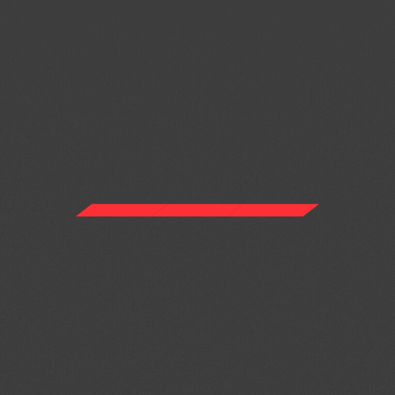
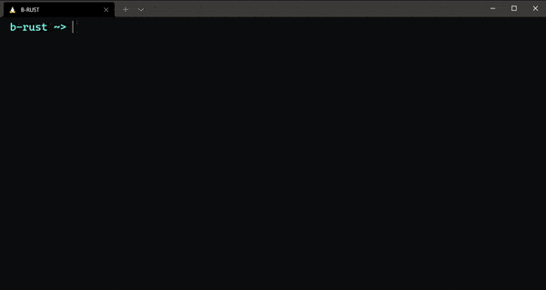

Rust playground in your terminal. 

# :bulb: Overview

Want to execute Rust code without installing rust? :crystal_ball: B-Rust can run your local code on :crab: [Rust Playground](https://play.rust-lang.org/) directly from your terminal.

# :pushpin: Installation

Just download the script, no need for any installation, it's that simple. :tada:

- Using cURL - `curl https://raw.githubusercontent.com/swanandx/b-rust/main/b-rust > b-rust && chmod +x ./b-rust`
- Using wget - `wget https://raw.githubusercontent.com/swanandx/b-rust/main/b-rust -O b-rust && chmod +x ./b-rust`

> You might need to install `jq` if you don't have it already.

# :construction: Note

This is just a script to make :crab: Rust Playground accessible from terminal. Code gets executed at https://play.rust-lang.org/ .

# :penguin: Contribution

We would appreciate any kind of contribution to b-rust, from fixing typos to making script more efficient or even making a better README. :clipboard: